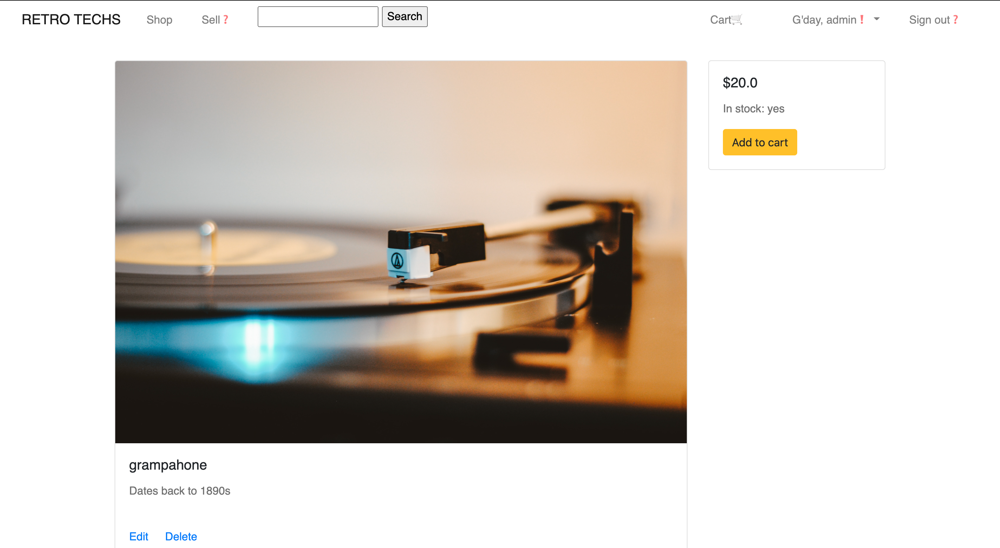
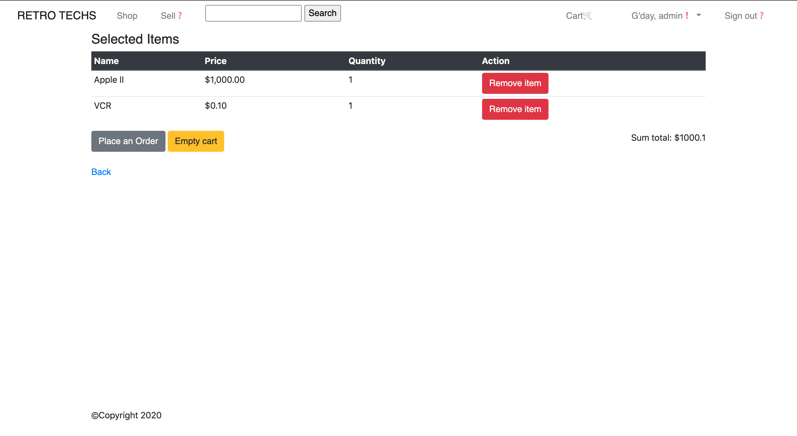

# Retro Techs - A two-sided marketplace application

## A link (URL) to your published App

https://quiet-hamlet-64153.herokuapp.com/

## A link to your GitHub repository

https://github.com/jacinyan/retro_techs

# Problems discovered, target audience and application Purpose

Over the past 40 years, the landscape of technologies have changed massively. Specifically, the evolution of electronic gadgets has grown much faster than people can ever imagine. In this day and age, we are definitely enjoying the benefits and convenience that the devices bring with them.

Perhaps it is worth looking at the problems found from another perspective. Reminiscence is something human beings share with each other, and it is a symbol of collective memories and emotions that give us comfort and a sense of contentment. 

Given such intensive technological developments, it is believed a large number of consumers are keen to own at least a piece or two of retro electronic devices, even just from a one or two years ago. Nevertheless, such items are very rarely seen in common marketplaces, and in light of this there is a potential niche market for retro techno gadgets. A two-sided marketplace targeting this may very well be a good candidate to tap into the unknown.

# User stories

Common:

    As a user, I need authentication before I am allowed to proceed to further actions.
    As a user, I must be authenticated through a certain means of communication, such as phone or email.
    As a user, I must be able to retrieve my authentication details through a certain means of communication, such as phone or email

Specific:

    As a seller, I can sell my items in the item index page.
    As a seller, I can manage my items, such as adjusting the price of my items and modifying the description.
    As a seller, I can communicate with the buyer as soon as an order is produced.
    
    As a buyer, I can see the listing of items in the item index page.
    As a buyer, I can see the details of the listed items show page
    As a buyer, I can communicate with the seller as soon as an order is produced.
    
    As an admin, I can manage all the actions performed on the platform/application.

# High-level components

A basic two-sided marketplace application usually has a registration management micro-system to manage users. In terms of security, a sign-up/sign-out interface is set up for users to register. Meanwhile, returning users are required to pass user authentication before they are allowed to make further actions through a sign-in interface. Certainly, users are enabled to edit/update their account details, such as their username, email address and password. In addition, users are able to retrieve their account in case they forget certain details.

With regards to authorisatoin, there is an assignment of roles to three types of users. The admin is in control of the entire application, who will be given the power to manipulate the entire application. For example. they can edit any item information, such as their name, in-stock status and price as well as delete them if necessary. Sellers are allowed to promote their items putting them up for sale at the marketplace by uploading related information, such as item images, yet they are limited to only modifying their own items. Surely, they are buyers at the same time and therefore they are also be able to make purchases. Regular users, namely buyers, are only allowed to make purchases and manage their orders. Finally, unregistered users are not able to do anything but browsing through the items.

In relation to real-time purchase, a search bar is set up to filter item information (item name for example). For item management, even though there is not a tree-structure category type of system, customers can still easily check out the imagery. As soon as a customer detects an ideal item, he/she is able to find out more details the item by clicking on the button, and then will be directed to a detail page to learn more about the name, status, price and description.

In addition, if a buyer finds an ideal they can temporarily put it in the shopping cart, and continue with other purchases. Before they decide to make an order, they are able review the items in the shopping cart. Whenever they feel ready, they can proceed to the order page where then can make further payment. Order management records the name and shipping address of a USER, yet they are not able to manage this kind of information which is accessed only by the admin.

# Screenshots

# Sitemap

# Tech Stack

The tech stack for the development of Retro Techs includes a variety of technologies. 

For website styling, basic HTML and CSS alongside a handy framework Bootstrap with its particular grid system are utilised for the overall layout and colour scheme.

Several Ruby Gems are applied in the application:

Devise is used for user authentication with the immense convenience that comes with it

Cancancan is used for user authorisation implementation, with which the assignment of different user roles is easily achieved.

AWS S3 is included for item uploading with the combination of cloud services and one of the most distinctive Rails feature ActiveStorage.

SimpleForm is applied for a better user information submission experience.

# Wireframes

# Third Party Services

Heroku is used to host the application via their server hosting services for developers to focus on local development.

Amazon S3 bucket is applied in the application as a cloud storage service that provides non-stop support which users have access to anywhere at any time along with the functionality of ActiveStorage.

Stripe is a potential candidate to be added into the application for payment management in the future. For the time being, it is not due to technical issues.

# Database Relations

The choice of database is a relational database.

The database relations start with only users, orders, items and order-items tables, where there is a one-to-many relations between users and orders, and a many-to-many relations between orders and items that can be broken down to two one-to-many relations in which order-items is the join table.   

Although they are the only entities that have physical meaning with regards to database changes, a fifth table named carts is introduced here, which is used to keep track of temporarily selected items by users as potential order items which may be transferred to the orders table at a later time. It can be seen as a 'virtual' table, and the relation this table has is to order-items only, which is a one-to-many relation.

To be more clear, an order-item record defined here is it is expected to be finally assigned a foreign key from the orders table at the end of a purchase.

# Database Schema Design

The database schema can be divided into five parts:

Users: This table is used for keeping track of user information where the attributes include username, email, password and its confirmation. The number of registered users grows with time, and therefore they need to be saved permanently in the database.

Orders: There is user information on it, from which a user_id as foreign key along with his/her real-life name and address attributes can be seen. It is to be stored in the database as well.

Items: This is essentially the item supplies table that tells whether or not a certain item exist. The item attributes are name, in-stock status, unit price and item description.

Order-Items：The only independent attribute on the table is the selected item quantity. The rest are item_id, cart_id, and order_id foreign keys. In this case, however, order_id's not null constraint is removed to facilitate interim data storage and transfer.

Carts: It can be seen as an entity in which a selected item (a potential order-item) is temporarily 'stored'. These selected items are subject to being destroyed. Cart_id's not null constraint is also removed to destroy the relations between order-items and carts by the end of a purchase.

Entity Relations Diagram:

Particularly, in the actual schema there is a role column for authorisation with Cancancan via Rails console. Correspondingly, there is a user_id column in items table for authorisation implementation.

# Description of ActiveRecord Associations

The most distinct association is the one between User and Order. It is a one-to-many association where a user may or may not have an order, yet an order exists on the condition a user exists. 

    class User < ApplicationRecord
        has_many :orders, dependent: :destroy
    end
    
    class Order < ApplicationRecord
        belongs_to :user
    end

Another association is the many-to-many between Order, OrderItem and Item. Also, In light of what is described above, an fifth model is also introduced in the application called Cart. The complexity can be seen this way. 

Firstly, a cart instance acts as a 'mailman' to collect prospective order-item instances from Item, the entire collection/source of items. 

    class Cart < ApplicationRecord
        has_many :order_items, dependent: :destroy
    end
    
    class OrderItem < ApplicationRecord
        belongs_to :cart
    end
    
    class OrderItem < ApplicationRecord
        belongs_to :item
    end
    
    class Item < ApplicationRecord
        has_many :order_items, dependent: :destroy
    end

As previously mentioned, a field named 'order' in order-items table from the schema is pre-defined for further actions, yet an order-item instance cannot be created by default. Therefore,

    class OrderItem < ApplicationRecord
        belongs_to :order, optional: true
    end

Finally, the 'mailman' successfully delivers order_item instances through this

    class OrderItem < ApplicationRecord
        belongs_to :order
    end
    
    class Order < ApplicationRecord
        has_many :order_items
    end

In addition, under certain circumstances order-item instances can exist with even the order instance being deleted. For example, an order is canceled by the user or there can be a potential Invoice model and further data transfer. Therefore, the association can be extended depending on needs

    class Order < ApplicationRecord
        has_many :order_items, dependent: :nullify
    end

As can be seen, @instance#order_items has a transformation from cart instance to order instance, but data can be delivered basically without errors because of the associations predefined.

# Task Flow

The details can be viewed through this link: https://trello.com/b/PmpicYIB/two-sided-marketplace

